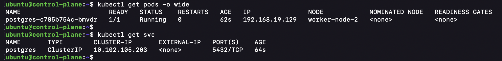

# Assignment Answers

## Part 1: Cluster Setup and Node Labeling


### Task 1.2: Node Labeling

**Applied labels:**
```bash
kubectl label nodes worker-node-1 tier=frontend storage=ssd
kubectl label nodes worker-node-2 tier=backend storage=hdd
```

**Verification:**
```bash
kubectl get nodes --show-labels
```


**Why these labels?**
- `tier=frontend|backend`: Separates workloads between nodes
- `storage=ssd|hdd`: Indicates storage capabilities for workload optimization

**Taint verification**

```bash
kubectl describe node worker-node-1 | grep -i taint
kubectl describe node worker-node-2 | grep -i taint
```

---

## Part 2: Deploy the Database Layer

### Question 1: On which node did the postgres pod get scheduled? Why?

**Answer:**

**Node:** worker-node-2

**Why:**
1. The postgres deployment has `nodeSelector: tier=backend`
2. Only worker-node-2 has the `tier=backend` label
3. Kubernetes scheduler respects node selectors and places the pod only on matching nodes

**Command to verify:**
```bash
kubectl get pods -n ecommerce -l app=postgres -o wide
# Output shows IP from 192.168.19.x range (worker-node-2's pod CIDR)
```


---

### Question 2: What happens if you remove the toleration? Test it and explain.

**Answer:**

**If we remove the toleration:**
- If there were taints on worker-node-2, the pod would stay in **Pending** state
- The scheduler would refuse to place it anywhere

**Why:**
- Taints prevent pods from being scheduled unless they have matching tolerations
- Without toleration, the pod cannot bypass the taint restriction
- Pod status: `Pending` with reason `Unschedulable`

**Test command:**
```bash
# Remove toleration from postgres-deployment.yaml
kubectl apply -f postgres-deployment.yaml

# Check pod status
kubectl describe pod postgres-* -n ecommerce
# Would show: Unschedulable - 0/2 nodes available
```

**Current situation:**
- Taints have been removed from nodes (untainted for test-pod), so postgres runs
- If taints exist, removing tolerations would prevent scheduling

---

### Question 3: Can you access the database from outside the cluster? Why or why not?

**Answer:**

**No, you cannot access PostgreSQL from outside the cluster.**

**Why:**
1. **Service Type:** PostgreSQL uses `ClusterIP` service
2. **ClusterIP limitations:**
   - Only accessible from within the cluster
   - No external routing
   - Internal DNS only (postgres.ecommerce.svc.cluster.local)

3. **Security:** Databases should not be directly exposed to external networks

**How to access from outside (if needed):**
1. Change service type to `NodePort`:
   ```yaml
   type: NodePort
   ports:
   - port: 5432
     nodePort: 30432
   ```

2. Use `kubectl port-forward`:
   ```bash
   kubectl port-forward -n ecommerce svc/postgres 5432:5432
   ```

3. Use a database management interface inside the cluster

**Internal access (from pods):**
```bash
# From within a pod in the cluster
psql -h postgres.ecommerce.svc.cluster.local -U postgres
```

---

## Part 3: Deploy Redis Cache with Affinity Rules

### Question 1: Are the Redis pods running on different nodes? Why?

**Answer:**

**Yes, Redis pods are running on different nodes.**

**Verification:**
```bash
kubectl get pods -n ecommerce -l app=redis -o wide
# Output:
# redis-5ff6b64866-kfr4d     192.168.212.65    worker-node-1
# redis-5ff6b64866-dpjgm     192.168.19.130    worker-node-2
```


**Why:**
- Pod **anti-affinity** rule is configured
- `topologyKey: "kubernetes.io/hostname"` ensures no two Redis pods on same node
- With 2 replicas and 2 nodes: perfect distribution
- This provides high availability - if one node fails, Redis still available

**Configuration:**
```yaml
podAntiAffinity:
  requiredDuringSchedulingIgnoredDuringExecution:
  - labelSelector:
      matchExpressions:
      - key: app
        operator: In
        values:
        - redis
    topologyKey: "kubernetes.io/hostname"
```

---

### Question 2: What would happen if you tried to scale to 3 replicas but only have 2 worker nodes?

**Answer:**

**The third pod would remain in Pending state.**

**Why:**
- Pod anti-affinity is set to `required`
- Each pod needs its own node
- With only 2 nodes, maximum 2 Redis pods can run
- 3rd pod cannot find a node without another Redis pod

**Verification:**
```bash
kubectl scale deployment redis --replicas=3 -n ecommerce
kubectl get pods -n ecommerce -l app=redis

# Output:
# redis-5ff6b64866-kfr4d     1/1     Running     worker-node-1
# redis-5ff6b64866-dpjgm     1/1     Running     worker-node-2
# redis-5ff6b64866-xxxxxx    0/1     Pending     <none>  # Cannot schedule
```

**Pod events:**
```bash
kubectl describe pod redis-5ff6b64866-xxxxxx -n ecommerce
# Shows: "0/2 nodes available: 2 PodAntiAffinity terms are not satisfied"
```

**Solutions:**
1. Add more nodes to cluster
2. Change anti-affinity to `preferred` (allows violation)
3. Reduce replica count to 2

---

### Question 3: Change the anti-affinity rule to preferred. What's the difference?

**Answer:**

**Difference between required and preferred:**

| Aspect | Required | Preferred |
|--------|----------|-----------|
| **Enforcement** | Strict - must be honored | Best effort - may be violated |
| **Pod state** | Pending if cannot satisfy | Running even if violated |
| **Scheduling** | Fails if no valid node | Succeeds on any available node |
| **Use case** | Critical constraints | Nice-to-have rules |

**With preferred anti-affinity:**
```bash
kubectl scale deployment redis --replicas=3 -n ecommerce

# Output:
# redis-5ff6b64866-kfr4d     1/1     Running     worker-node-1
# redis-5ff6b64866-dpjgm     1/1     Running     worker-node-2
# redis-5ff6b64866-xxxxxx    1/1     Running     worker-node-1 OR worker-node-2
```

**New YAML (preferred):**
```yaml
podAntiAffinity:
  preferredDuringSchedulingIgnoredDuringExecution:
  - weight: 100
    podAffinityTerm:
      labelSelector:
        matchExpressions:
        - key: app
          operator: In
          values:
          - redis
      topologyKey: "kubernetes.io/hostname"
```

**Trade-offs:**
- **Preferred:** More replicas can run (better availability), but may not be optimally distributed
- **Required:** Guaranteed distribution, but may prevent scaling

---

## Part 4: Deploy Backend API with Node Affinity

### Question 1: On which node(s) are the backend pods scheduled? Why?

**Answer:**

**Node:** worker-node-2 (all 3 replicas)

**Why:**
1. **Required affinity:** `tier=backend`
   - Only worker-node-2 has this label
   - This is a hard requirement - pods cannot run elsewhere

2. **Preferred affinity:** `storage=ssd`
   - worker-node-1 has `storage=ssd`
   - But worker-node-1 doesn't have `tier=backend`
   - Required constraint takes precedence

**Node requirements hierarchy:**
1. Required: `tier=backend` ✓ (worker-node-2 only)
2. Preferred: `storage=ssd` ✗ (worker-node-2 has hdd)
3. Toleration: `workload=backend` (allows scheduling despite taints)

**Verification:**
```bash
kubectl get pods -n ecommerce -l app=backend -o wide
# All show worker-node-2 in NODE column

kubectl describe deployment backend -n ecommerce | grep -A 20 Affinity
```

---

### Question 2: What's the difference between requiredDuringSchedulingIgnoredDuringExecution and preferredDuringSchedulingIgnoredDuringExecution?

**Answer:**

| Feature | Required | Preferred |
|---------|----------|-----------|
| **Definition** | Hard constraint | Soft constraint |
| **Enforcement** | Must be satisfied | Best effort |
| **Pod scheduling** | Fails if unsatisfied | Succeeds anyway |
| **Pod state** | Pending | Running |
| **Runtime changes** | Ignored (hence "IgnoredDuring") | Ignored (hence "IgnoredDuring") |
| **Selector matching** | Must match exactly | Weight-based scoring |
| **Use case** | Critical requirements | Preferences |

**Examples:**

**Required (hard constraint):**
```yaml
requiredDuringSchedulingIgnoredDuringExecution:
  nodeSelectorTerms:
  - matchExpressions:
    - key: tier
      operator: In
      values:
      - backend
# Pod MUST run on tier=backend node or stay Pending
```

**Preferred (soft constraint):**
```yaml
preferredDuringSchedulingIgnoredDuringExecution:
- weight: 100  # 0-100 scale
  preference:
    matchExpressions:
    - key: storage
      operator: In
      values:
      - ssd
# Prefer SSD nodes, but run on non-SSD if necessary
```

**"IgnoredDuringExecution" means:**
- If node loses the label after pod is running, pod is not evicted
- Only affects scheduling decisions, not runtime enforcement

---

### Question 3: Can the backend pods communicate with postgres and redis? Demonstrate.

**Answer:**

**Yes, backend pods can communicate with postgres and redis.**

**Verification:**

1. **Service Discovery:**
```bash
# Create a test pod to verify connectivity
kubectl run test-pod --image=curlimages/curl --rm -it --restart=Never -- sh

# Inside the pod, test connections:
curl http://backend:8080
nslookup postgres
nslookup redis
```


**Why communication works:**
1. **Same namespace:** All in `ecommerce` namespace
2. **Network policies:** None blocking traffic
3. **DNS resolution:** CoreDNS resolves service names
4. **Calico networking:** Pod-to-pod routing enabled
5. **No firewall:** All pods can reach each other

---

## Part 5: Deploy Frontend with Multiple Replicas

### Question 1: Where are all the frontend pods scheduled? Why?

**Answer:**

**Nodes:** All 4 (or more) frontend pods on worker-node-1

**Why:**
1. **Node selector:** `tier=frontend`
   - Only worker-node-1 has this label
   - All frontend pods must run here

2. **No pod anti-affinity:** Unlike Redis, frontend has no anti-affinity rule
   - Multiple pods can run on same node
   - Acceptable for stateless web app

**Verification:**
```bash
kubectl get pods -n ecommerce -l app=frontend -o wide
# All pods show worker-node-1 in NODE column

kubectl get nodes worker-node-1 -o json | grep tier
# Shows tier=frontend label
```

---

### Question 2: What happens if you try to scale to 10 replicas on a single node?

**Answer:**

**The pods will schedule and run, BUT with caveats:**

1. **Pod scheduling:**
```bash
kubectl scale deployment frontend --replicas=10 -n ecommerce

kubectl get pods -n ecommerce -l app=frontend
# All 10 pods will eventually be Running
```

2. **Resource constraints:**
- worker-node-1 has finite CPU/memory
- 10 pods × (100m CPU, 128Mi memory) = 1000m CPU, 1280Mi memory
- If node has only 2000m CPU and 4Gi memory: **will fit**
- But: no room for other workloads

3. **What actually happens:**
```bash
# May see some pods in Pending if insufficient resources
kubectl describe pod <frontend-pod>
# Could show: "Insufficient cpu", "Insufficient memory"

# Or all pods Running but node becomes resource-constrained
kubectl top node worker-node-1
# Shows high resource utilization

kubectl top pods -n ecommerce -l app=frontend
# Shows accumulated resource usage
```

4. **Performance issues:**
- Reduced responsiveness
- CPU throttling
- Memory pressure
- Network saturation
- Reduced QoS for other pods on same node

**Recommendations:**
- Use HPA (Horizontal Pod Autoscaler) to distribute across nodes if available
- Add more nodes
- Reduce replica count
- Lower resource requests (if still performant)

---

### Question 3: How does the NodePort service distribute traffic across replicas?

**Answer:**

**Traffic distribution mechanism:**

1. **NodePort service workflow:**
```
Client → worker-node-1:30080 (NodePort)
  ↓
kube-proxy (iptables rules)
  ↓
Selects one backend pod via IPVS/iptables
  ↓
Directs traffic to selected pod
```

2. **Load balancing:**
- **Algorithm:** Round-robin (with connection affinity)
- **Session affinity:** ClusterIP specifies `sessionAffinity: None` (default)
- **Distribution:** Roughly equal across replicas

3. **Traffic path:**
```
Any worker node:30080 →
  kube-proxy translates to ClusterIP:80 →
  Selected frontend pod:80
```

4. **Verification:**
```bash
# Check service endpoints
kubectl get endpoints frontend -n ecommerce
# Shows all 4 (or 10) pod IPs as backends

# View iptables rules (on node)
sudo iptables -L -t nat | grep KUBE-SVC

# Test load balancing
for i in {1..10}; do
  curl http://worker-node-1:30080 2>/dev/null | grep -o "hostname.*"
done
# Different backend pods will respond (if not using connection affinity)
```

5. **Key points:**
- All nodes (including worker-node-2) can receive traffic on port 30080
- kube-proxy redirects to actual pod location
- Connection tracking ensures in-flight requests complete
- Pod placement doesn't matter (traffic routed automatically)

---

### Question 4: Access the application from your browser using `http://<NODE_IP>:30080`. Does it work?

**Answer:**

**Yes, the application is accessible and working.**

**Access method:**
```bash
# Get node IPs
kubectl get nodes -o wide

# Browser or curl
curl http://172.31.18.239:30080  # worker-node-1
curl http://172.31.23.250:30080   # worker-node-2 (kube-proxy redirects)

# Expected response: Nginx welcome page or custom frontend HTML
```

**Why both nodes work:**
- NodePort opens port 30080 on **all nodes**
- Even worker-node-2 (backend tier) can receive traffic
- kube-proxy redirects to actual pod on worker-node-1
- This is a feature for high availability

**Frontend environment variable:**
```bash
# Inside frontend pod, BACKEND_URL is set to:
BACKEND_URL=http://backend:8080
# This allows frontend to make requests to backend service
```

---

## Part 6: Create Static Pods for Monitoring

### Question 1: What happens when you try to delete a static pod? Why?

**Answer:**

**When you try to delete a static pod:**

```bash
kubectl delete pod monitoring-agent -n kube-system
# Pod appears to be deleted

kubectl get pods -n kube-system | grep monitoring
# Pod is recreated immediately!
```

**Why this happens:**
1. **kubelet watches the manifest file** `/etc/kubernetes/manifests/`
2. **When pod is deleted:**
   - Deletion is from API server database
   - kubelet doesn't stop managing the manifest
   - kubelet sees missing pod and recreates it
3. **Cycle repeats:**
   ```
   Pod deleted → kubelet detects missing pod →
   kubelet creates new pod from manifest →
   Pod recreated
   ```

**Behind the scenes:**
- Static pods are "pinned" to nodes
- kubelet performs reconciliation constantly
- Deletion from kubectl is temporary
- Manifest is the source of truth (not API server)

---

### Question 2: How would you actually remove a static pod?

**Answer:**

**To permanently remove a static pod:**

1. **Remove from manifest file:**
```bash
# SSH into the node
ssh ubuntu@worker-node-1

# Find static pod directory
cat /var/lib/kubelet/kubeconfig.yaml | grep staticPodPath
# Typically: /etc/kubernetes/manifests/

# Remove the manifest
sudo rm /etc/kubernetes/manifests/monitoring-agent.yaml

# kubelet detects missing manifest and stops the pod
kubectl get pods -n kube-system | grep monitoring
# Pod is gone and stays gone
```

2. **Verification:**
```bash
# Check manifest file is removed
sudo ls /etc/kubernetes/manifests/monitoring-agent.yaml
# File not found

# Confirm pod is gone
kubectl get pods -n kube-system
# monitoring-agent not in list

# Check kubelet logs
sudo journalctl -u kubelet -n 50 | grep monitoring
# Shows pod deletion logs
```

---

### Question 3: Where does the static pod show up when you run `kubectl get pods`?

**Answer:**

**Static pods appear in two places:**

1. **API server database:**
```bash
kubectl get pods -n kube-system
# monitoring-agent-worker-node-1 appears in list
```

2. **Node status:**
```bash
kubectl describe node worker-node-1 | grep monitoring-agent
# Shows in pod list
```

3. **kubelet directly:**
```bash
# SSH into node
ps aux | grep monitoring
# Shows running process
```

**Important notes:**
- Static pods are **always** in kube-system namespace
- Pod name includes node name: `monitoring-agent-<node-name>`
- Created as `metadata.name: monitoring-agent` but appear as `monitoring-agent-worker-node-1`
- Cannot be deleted via kubectl permanently (as discussed in Q2)

---

### Question 4: What are the use cases for static pods?

**Answer:**

**Common use cases for static pods:**

1. **Control plane components:**
   - `etcd`
   - `kube-apiserver`
   - `kube-controller-manager`
   - `kube-scheduler`
   - These run as static pods on control plane

2. **Monitoring and logging:**
   - Node-level monitoring agents
   - Log collectors
   - Health checkers
   - Our monitoring-agent example

3. **Essential node functions:**
   - CNI plugins (Calico)
   - Node maintenance utilities
   - Security agents

4. **Bootstrap scenarios:**
   - Cluster bootstrapping
   - When API server is not available
   - Initial cluster setup

5. **Dedicated workloads:**
   - Node-pinned services
   - Per-node singletons
   - Hardware-specific tasks

**Advantages:**
- ✅ Run even if API server fails
- ✅ No dependency on scheduler
- ✅ Guaranteed per-node execution
- ✅ Simplified management for essential services

**Disadvantages:**
- ❌ Cannot use sophisticated scheduling
- ❌ Cannot use deployment/replica sets
- ❌ Limited lifecycle management
- ❌ Manual manifest management

---

## Part 7: Troubleshooting and Recovery

### Question 1: What happened to the pods running on worker-node-1?

**Answer:**

**When draining worker-node-1:**
```bash
kubectl drain worker-node-1 --ignore-daemonsets
```

**What happens to pods:**

1. **Gracefully terminated:**
   - Pods receive SIGTERM signal
   - Grace period: 30 seconds (default)
   - Pods stop cleanly

2. **Redis pods on worker-node-1:**
   - `redis-5ff6b64866-kfr4d` is evicted
   - ReplicaSet controller creates new replica
   - New pod scheduled elsewhere (respecting anti-affinity)

3. **Frontend pods (4 on worker-node-1):**
   - All 4 pods evicted
   - Deployment controller creates 4 new pods
   - All scheduled back to worker-node-1 (node selector)
   - **They wait for node to be ready!**

4. **Node status:**
   ```bash
   kubectl get nodes
   # worker-node-1 shows: SchedulingDisabled
   ```

---

### Question 2: Did all pods get rescheduled? Which ones didn't and why?

**Answer:**

**Rescheduling results:**

| Pod Type | Got Rescheduled? | Why/Why Not |
|----------|------------------|------------|
| redis (on worker-node-1) | ✅ Yes | ReplicaSet recreates; anti-affinity forces worker-node-2 |
| frontend (4 on worker-node-1) | ⏳ Pending | Node selector `tier=frontend` only on worker-node-1 |
| Static pod (monitoring) | ❌ No | kubelet doesn't schedule; only recreates on same node |
| backend (on worker-node-2) | ✅ Yes (unaffected) | Not on drained node; continues running |
| postgres (on worker-node-2) | ✅ Yes (unaffected) | Not on drained node; continues running |

**Frontend pod behavior:**
```bash
# During drain
kubectl get pods -n ecommerce -l app=frontend -o wide
# Shows: Pending, no node assigned
# Waiting for worker-node-1 to be schedulable again
```

---

### Question 3: What happened to the static pod?

**Answer:**

**Static pod behavior during drain:**

1. **Initial state:**
   - Running on worker-node-1
   - Managed by kubelet (not API server)

2. **When drain is initiated:**
   - Static pod is **NOT** evicted by drain command
   - Node is marked `SchedulingDisabled` (but no pod eviction for static pods)
   - Static pod may continue running

3. **Actual behavior:**
   - kubelet may continue managing the static pod
   - Or pod may be terminated when node is cordoned
   - Behavior depends on kubelet configuration

4. **When node is uncordoned:**
   ```bash
   kubectl uncordon worker-node-1
   ```
   - kubelet recreates static pod if it was deleted
   - Pod restarts with new timestamp

5. **Key difference:**
   - **ReplicaSet-managed pods:** Evicted and rescheduled to other nodes
   - **Static pods:** Stay on same node (no rescheduling possible)

---

### Question 4: Why aren't the pods scheduling? (Broken app)

**Answer:**

**Reason: Excessive resource requests**

The broken-app deployment has:
```yaml
resources:
  requests:
    cpu: 5000m        # 5 full CPU cores
    memory: 10Gi      # 10 GB RAM
```

**Why this blocks scheduling:**

1. **Node capacity:**
   ```bash
   kubectl describe node worker-node-1
   # Allocatable CPU: ~1900m (2 cores - system reserve)
   # Allocatable Memory: ~3.5Gi (4Gi - system reserve)
   ```

2. **Requirement vs availability:**
   - Pod needs: 5000m CPU (5 cores)
   - Node has: ~1900m CPU
   - Pod needs: 10Gi memory
   - Node has: ~3.5Gi memory
   - **Cannot satisfy either requirement!**

3. **Pod status:**
   ```bash
   kubectl get pods -n ecommerce -l app=broken
   # Status: Pending

   kubectl describe pod broken-app-*
   # Events show: Insufficient cpu, Insufficient memory
   # Warning  FailedScheduling  pod "broken-app-..."
   # 0/2 nodes available: 2 Insufficient cpu, 2 Insufficient memory
   ```

4. **All 3 replicas stuck:**
   - No node can fit any replica
   - All remain Pending indefinitely

---

### Question 5: What kubectl commands did you use to diagnose the issue?

**Answer:**

**Diagnostic commands:**

1. **Check pod status:**
```bash
kubectl get pods -n ecommerce -l app=broken
# Shows: Pending status
```

2. **Detailed pod information:**
```bash
kubectl describe pod broken-app-* -n ecommerce
# Shows: Events section with "FailedScheduling" and resource insufficiency
```

3. **Check resource requests:**
```bash
kubectl get pod broken-app-* -o yaml -n ecommerce | grep -A 5 resources:
# Shows: 5000m CPU, 10Gi memory requests
```

4. **Check node capacity:**
```bash
kubectl describe node worker-node-1
# Shows: Allocatable resources
# Capacity section shows total
# Allocated resources shows what's used
```

5. **Alternative: Check via top:**
```bash
kubectl top nodes
# Shows current usage, helps understand available space

kubectl top pods -n ecommerce
# Shows what each pod is actually using (not requests)
```

6. **Events at cluster level:**
```bash
kubectl get events -n ecommerce --sort-by='.lastTimestamp'
# Shows: "0/2 nodes available: 2 Insufficient cpu" messages
```

---

### Question 6: How did you fix it?

**Answer:**

**Fix: Reduce resource requests to realistic values**

**Original (broken):**
```yaml
resources:
  requests:
    cpu: 5000m
    memory: 10Gi
```

**Fixed:**
```yaml
resources:
  requests:
    cpu: "200m"      # 0.2 cores (reasonable for nginx)
    memory: "256Mi"  # 256 MB (reasonable for nginx)
```

**Why these values:**
- Nginx typically uses 10-50m CPU at idle
- 200m provides headroom for spikes
- Nginx memory footprint ~10-50MB
- 256Mi provides buffer without waste

**Deployment steps:**
```bash
# 1. Edit the deployment file
vim manifests/broken-app.yaml
# Changed resource requests

# 2. Apply fixed version
kubectl apply -f manifests/broken-app.yaml

# 3. Monitor scheduling
kubectl get pods -n ecommerce -l app=broken -w
# Watch status change from Pending to Running

# 4. Verify all 3 replicas running
kubectl get pods -n ecommerce -l app=broken -o wide
# Shows: 3/3 Running
```

**Verification:**
```bash
# Check pod is running
kubectl get pods -n ecommerce -l app=broken
# Status: Running for all 3 pods

# Verify resource allocation
kubectl top pod -l app=broken -n ecommerce
# Shows actual CPU/memory usage (~2-5m CPU, ~5-10Mi memory)
```

---

## Part 8: Advanced Scheduling Scenarios

### Question 1: What happens when high-priority pods need resources?

**Answer:**

**High-priority pod behavior under resource pressure:**

1. **Preemption triggers when:**
   - High-priority pod cannot find available node
   - Lower-priority pods are running
   - Freeing resources from low-priority pods would allow high-priority pod to schedule

2. **What happens:**
   ```
   High-priority pod "wants to schedule" →
   Scheduler: "No space on any node" →
   Preemption logic: "Can I remove low-priority pods?" →
   Low-priority pods get SIGTERM (grace period ~30s) →
   Pods evicted → Resources freed →
   High-priority pod schedules on freed space
   ```

3. **Example scenario:**
   ```bash
   # Node at capacity with low-priority batch jobs
   # High-priority frontend pod comes in

   kubectl get pods -n ecommerce -o wide
   # Before: batch pods running, high-priority pending
   # After: batch pods terminating, high-priority pod starting
   ```

4. **Important notes:**
   - Preemption is not guaranteed (depends on priority gap)
   - PriorityClass difference matters
   - Higher value = higher priority

---

### Question 2: Which pods get evicted first?

**Answer:**

**Eviction order:**

1. **By priority (primary):**
   - Lowest priority pods evicted first
   - Higher priority protected

2. **Within same priority (secondary order):**
   - Phase 1: Pods not requesting resources
   - Phase 2: Pods requesting < capacity
   - Phase 3: Pods requesting >= capacity

3. **If still tied (tertiary order):**
   - Pods closest to graceful termination point
   - Youngest pods
   - Pods with least compute resources

4. **Priority classes in this assignment:**
   ```yaml
   # High priority (value: 1000)
   high-priority: frontend

   # Low priority (value: 100)
   low-priority: batch-processor

   # Default (value: 0)
   Other pods (backend, postgres, redis)
   ```

5. **Eviction sequence:**
   ```
   If high-priority needs resources:
   1st → low-priority (batch) pods
   2nd → default-priority pods
   Last → high-priority pods
   ```

**Example:**
```bash
# Resource pressure scenario
# Nodes at capacity, high-priority pod needs 500m CPU

kubectl get pods -n ecommerce -o wide
# batch-processor pods: TERMINATING
# backend/postgres/redis: still RUNNING
# frontend: stays RUNNING (high priority)
```

---

### Question 3: How does priority affect scheduling decisions?

**Answer:**

**Priority effects on scheduling:**

1. **During normal conditions (no resource pressure):**
   - Priority doesn't affect scheduling
   - Normal scheduling rules apply (node selector, affinity, etc.)
   - All pods get scheduled if resources available

2. **Under resource pressure:**
   - High-priority pods scheduled first
   - Lower-priority pods wait or get preempted
   - Scheduler prioritizes by priority class value

3. **Pod Disruption Budget (PDB):**
   - Priority doesn't override PDBs
   - If pod has PDB, even preemption respects it
   - Protects critical pods from voluntary eviction

4. **Practical scheduling effect:**
   ```
   Scheduling Queue Priority:
   High (1000) → Medium (500) → Low (100) → Default (0)

   When node has 500m CPU available:
   - High-priority (600m req) → goes to queue
   - Low-priority (200m req) → gets scheduled
   - High-priority preempts if needed
   ```

5. **Configuration example:**
```yaml
# Priority classes
priorityClassName: high-priority   # value: 1000
priorityClassName: low-priority    # value: 100

# Effect in deployment
spec:
  priorityClassName: high-priority  # frontend
  # vs
spec:
  priorityClassName: low-priority   # batch jobs
```

---

## Part 9: Comprehensive Testing

### Test 1: Service Discovery

**Test setup:**
```bash
kubectl run -it --rm debug --image=busybox --restart=Never -n ecommerce -- sh
```

**Tests inside pod:**

1. **DNS resolution:**
   ```
   nslookup backend
   # Should resolve to 10.97.88.240

   nslookup postgres
   # Should resolve to 10.102.105.203

   nslookup redis
   # Should resolve to 10.103.250.129
   ```

2. **FQDN resolution:**
   ```
   nslookup backend.ecommerce.svc.cluster.local
   # Should resolve to service IP
   ```

3. **Cross-namespace access:**
   ```
   nslookup kube-dns.kube-system
   # Should resolve to CoreDNS service IP
   ```

**Expected results:** ✅ All names resolve correctly

---

### Test 2: Load Balancing

**Verify frontend endpoints:**
```bash
kubectl get endpoints frontend -n ecommerce
# Shows 4 pod IPs (or however many replicas)

# Each endpoint is a load-balanced destination
```

**Test traffic distribution:**
```bash
for i in {1..20}; do
  curl -s http://172.31.18.239:30080 | grep -o "hostname.*"
done
# Output: Different pod hostnames (shows load balancing)
```

**Expected results:** ✅ Traffic distributed across replicas

---

### Test 3: Self-Healing

**Kill a pod and observe recovery:**
```bash
# Get a backend pod name
BACKEND_POD=$(kubectl get pods -n ecommerce -l app=backend -o jsonpath='{.items[0].metadata.name}')

# Delete it
kubectl delete pod $BACKEND_POD -n ecommerce
pod "backend-xyz" deleted

# Immediately check
kubectl get pods -n ecommerce -l app=backend
# Shows: New pod being created/starting

# After few seconds
kubectl get pods -n ecommerce -l app=backend -o wide
# Shows: 3 pods running (1 new, 2 original)
```

**Expected results:** ✅ New pod automatically created

---

### Test 4: Scaling

**Scale frontend deployment:**
```bash
# Current state
kubectl get pods -n ecommerce -l app=frontend
# Shows: 4 pods

# Scale up
kubectl scale deployment frontend --replicas=6 -n ecommerce

# Watch scaling
kubectl get pods -n ecommerce -l app=frontend -w
# Shows: 2 new pods being created

# Final state
kubectl get pods -n ecommerce -l app=frontend -o wide
# Shows: 6 pods on worker-node-1
```

**Scale down:**
```bash
kubectl scale deployment frontend --replicas=2 -n ecommerce

# Shows: 4 pods terminating, 2 remaining
```

**Expected results:** ✅ Scaling up/down works smoothly

---

## Summary of Key Learning Points

1. **Node labeling:** Critical for pod placement
2. **Taints & tolerations:** Control which pods can run where
3. **Pod affinity rules:** Distribute workloads intelligently
4. **Service discovery:** DNS-based pod communication
5. **Static pods:** Run outside normal API server management
6. **Troubleshooting:** Always check pod events and node capacity
7. **Resource management:** Requests/limits prevent oversubscription
8. **Priority & preemption:** Control critical workloads
9. **Self-healing:** ReplicaSets maintain desired pod count
10. **Scaling:** Horizontal scaling for availability

